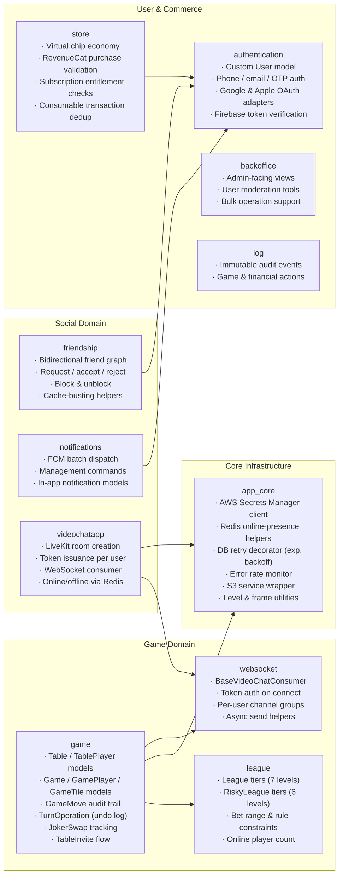
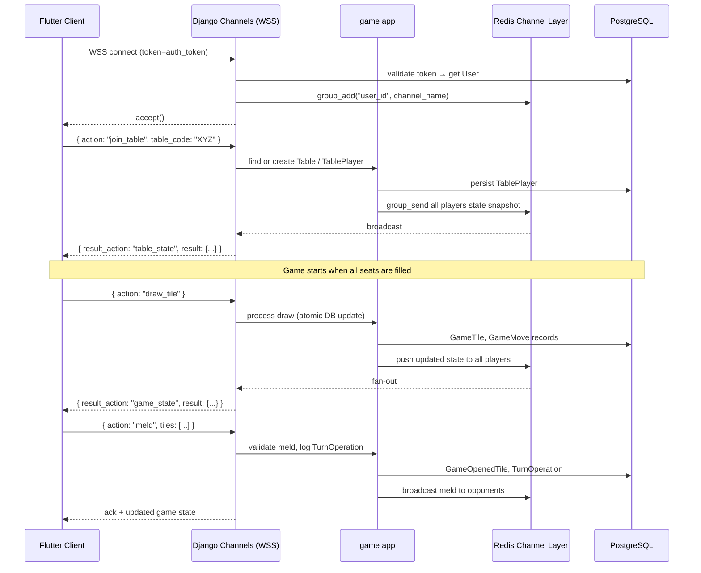
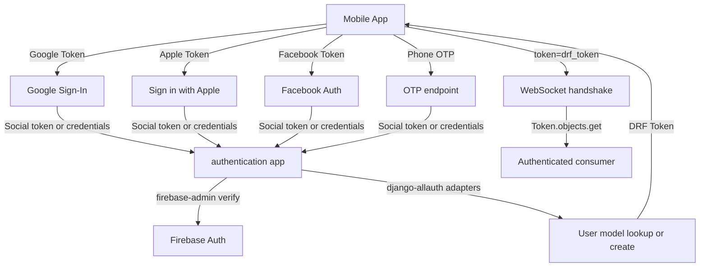
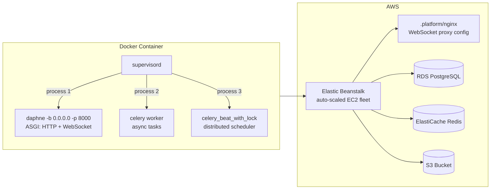
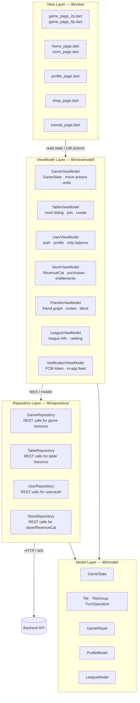
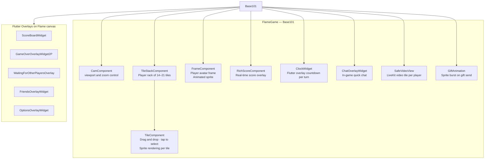
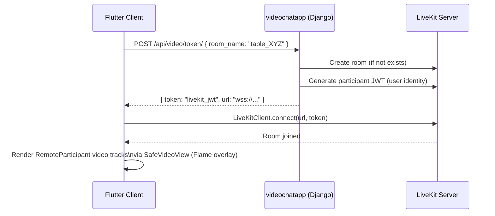
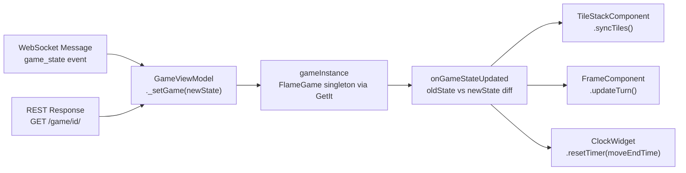

# Okey 101 — Real-Time Multiplayer Turkish Tile Game Platform


> A production-grade real-time multiplayer platform for the classic Turkish tile game Okey 101. Built with a Django 5 ASGI backend serving WebSocket game rooms and a REST API, paired with a Flutter/Flame cross-platform client featuring live in-game video chat, a seasonal league system, a virtual in-app economy, and social mechanics — all deployed on AWS.

---

## Table of Contents

1. [Project Overview](#project-overview)
2. [System Architecture](#system-architecture)
3. [Repository Structure](#repository-structure)
4. [Backend Deep Dive](#backend-deep-dive)
   - [Technology Stack](#backend-technology-stack)
   - [Django Application Map](#django-application-map)
   - [WebSocket Protocol & Game Flow](#websocket-protocol--game-flow)
   - [Real-Time Infrastructure](#real-time-infrastructure)
   - [In-App Economy & Monetisation](#in-app-economy--monetisation)
   - [Authentication & Security](#authentication--security)
   - [Resilience Engineering](#resilience-engineering)
   - [Deployment](#deployment)
5. [Mobile App Deep Dive](#mobile-app-deep-dive)
   - [Technology Stack](#mobile-technology-stack)
   - [MVVM Architecture](#mvvm-architecture)
   - [Flame Game Engine Integration](#flame-game-engine-integration)
   - [WebRTC Video Chat](#webrtc-video-chat)
   - [State Management](#state-management)
6. [Key Engineering Decisions](#key-engineering-decisions)
7. [Source Code](#source-code)

---

## Project Overview

Okey 101 is a fully-featured online version of the most popular Turkish tile game. Players can join ranked league tables, challenge friends, wager in-game chips, and communicate face-to-face through integrated video chat — all in real time.

The platform consists of two independently deployable components:

- **`okey-101-backend`** — Python/Django ASGI server handling REST, WebSocket game rooms, background task processing, push notifications, and video room orchestration.
- **`okey-101-mobile`** — Flutter/Dart cross-platform client (iOS & Android) with a custom 2D game board rendered by the Flame engine.

---

## System Architecture

```mermaid
graph TB
    subgraph Client["📱 Flutter Mobile App (iOS & Android)"]
        direction TB
        FLAME["🎮 Flame Engine\nTile Rendering · Game Loop · Animations"]
        UI["🖼 Flutter UI Layer\nLobby · Profile · Social · Shop"]
        VM["⚙️ ViewModel Layer\nProvider + GetIt (MVVM)"]
        WS_C["🔌 WebSocket Client\nweb_socket_channel"]
        LIVEKIT_C["📹 LiveKit Client\nflutter_webrtc · WebRTC"]
        AUTH_C["🔑 Auth\nGoogle · Apple · Facebook · Firebase"]
    end

    subgraph Backend["🖥 Django 5 ASGI Backend"]
        direction TB
        DAPHNE["Daphne ASGI Server"]

        subgraph Transport["Transport Layer"]
            REST["Django REST Framework\ndrf-spectacular · OpenAPI 3"]
            CHANNELS["Django Channels 4\nWebSocket Game Rooms"]
        end

        subgraph Apps["Django Apps"]
            GAME["game\nCore game engine & state machine"]
            LEAGUE["league\nSeasonal ranking & promotions"]
            FRIENDSHIP["friendship\nSocial graph · Blocking"]
            VIDEO["videochatapp\nLiveKit token issuance"]
            NOTIF["notifications\nFCM push dispatch"]
            AUTH_APP["authentication\nCustom user model · OTP · Social"]
            STORE["store\nVirtual economy · RevenueCat"]
            BACKOFFICE["backoffice\nAdmin & moderation ops"]
            LOG_APP["log\nAudit trail for game events"]
        end

        CELERY["Celery 5 Workers\nBackground tasks · Scheduled jobs"]
        APP_CORE["app_core\nRedis utils · DB retry · Error monitoring · S3 · AWS Secrets"]
    end

    subgraph Infra["☁️ Infrastructure (AWS)"]
        PG[("PostgreSQL\nGame & user state")]
        REDIS[("Redis\nChannel layer · Online presence · Cache")]
        S3[("AWS S3\nMedia · Profile photos")]
        FCM["Firebase Cloud Messaging\nPush notifications"]
        LIVEKIT_SRV["LiveKit Server\nWebRTC SFU · Video rooms"]
        EB["AWS Elastic Beanstalk\nAuto-scaled container deployment"]
    end

    Client -- "HTTPS REST" --> REST
    Client -- "WSS (token auth)" --> CHANNELS
    LIVEKIT_C -- "WebRTC" --> LIVEKIT_SRV
    DAPHNE --> Transport
    CHANNELS -- "channel layer pub/sub" --> REDIS
    CELERY -- "broker" --> REDIS
    Apps --> PG
    Apps --> APP_CORE
    APP_CORE --> REDIS
    AUTH_APP --> FCM --> Client
    APP_CORE --> S3
    VIDEO --> LIVEKIT_SRV
    Backend --> EB
```



---

## Repository Structure

| Repository | Language | Primary Role |
|---|---|---|
| `okey-101-backend` | Python 3.11 · Django 5 | ASGI game server, REST API, WebSocket rooms, Celery workers |
| `okey-101-mobile` | Dart 3 · Flutter 3 | Cross-platform iOS/Android game client |

---

## Backend Deep Dive

### Backend Technology Stack

| Layer | Technology | Purpose |
|---|---|---|
| Language | Python 3.11 | Core runtime |
| Web Framework | Django 5.0 | ORM, admin, routing |
| ASGI Server | Daphne 4 | HTTP + WebSocket via ASGI |
| REST API | Django REST Framework 3.14 + drf-spectacular | Typed OpenAPI 3 schema generation |
| WebSockets | Django Channels 4 + channels-redis | Stateful game room consumers |
| Task Queue | Celery 5 + Redis broker | Async game events, notifications, scheduled tasks |
| Database | PostgreSQL + psycopg2 | Persistent game and user state |
| Cache / Presence | Redis (`redis-py`) | Channel layer, online user set, game state cache |
| Auth | Firebase Admin SDK + django-allauth + dj-rest-auth + PyJWT | Mobile token verification + social OAuth + OTP |
| Video | LiveKit SDK | WebRTC SFU room & token management |
| Push | Firebase Cloud Messaging (FCM) | Turn reminders, friend requests, game events |
| Storage | django-storages → AWS S3 | Media files and profile photos |
| i18n | django-rosetta + django-countries + django-phonenumber-field | Internationalisation and locale support |
| Payments | RevenueCat REST API | iOS/Android in-app purchase validation |
| Security | cryptography + pyOpenSSL | Token signing, secure transport |
| Process Mgmt | Supervisord | Orchestrates Daphne + Celery Worker + Celery Beat in Docker |
| Container | Docker + AWS Elastic Beanstalk | Containerised deployment with `.ebextensions` config |

---

### Django Application Map



---

### WebSocket Protocol & Game Flow

The game loop is entirely WebSocket-driven. Each authenticated client opens a persistent WSS connection through a `VideoChatConsumer` (Django Channels `AsyncWebsocketConsumer`). The server maintains a per-user channel group so any backend code can push to a player by user ID — without needing to hold a connection handle.



The message envelope format used throughout:

```json
{
  "id": "<uuid>",
  "request_action": "draw_tile",
  "result_action": "game_state",
  "result": { "..." : "..." },
  "error": null
}
```

---

### Real-Time Infrastructure

**Online Presence via Redis Sets**

A single Redis set (`ws:online_users`) tracks connected players. On WebSocket connect/disconnect, the server calls `mark_user_online` / `mark_user_offline`. Any part of the application can call `is_user_online(user_id)` to make routing decisions — for example, skipping FCM push if the target player is already in an active game session.

**Channel Layer Fan-Out**

Django Channels uses `channels-redis` as the channel layer backend. When the game engine needs to push a state update, it calls `async_to_sync(VideoChatConsumer.send_message_to_connected_user)(user_id, payload)` which publishes to the user's dedicated Redis group. All WebSocket connections for that user receive the message, enabling transparent multi-device support.

**Celery Beat with Distributed Lock**

A custom management command `celery_beat_with_lock` wraps Celery Beat startup with a Redis-backed distributed lock, ensuring only one beat scheduler runs at a time across multi-instance deployments on Elastic Beanstalk.

**Turn Timer**

Each `Game` row carries a `move_end_time` datetime field. Celery workers monitor expiry and trigger forced-move logic, pushing the resulting state snapshot to all players via the channel layer.

---

### In-App Economy & Monetisation

The platform implements a full virtual economy:

- **Chip system** — players wager chips per game. Chip counts are updated atomically with Django's `select_for_update()` to prevent race conditions under concurrent writes. A dedicated post-mortem document (`BUG_FIX_CHIP_COUNT_RACE_CONDITION.md`) details the concurrency pattern that was identified and patched in production.
- **In-app purchases** — iOS and Android purchases are validated server-side through the **RevenueCat** REST API (`store/services/revenuecat.py`). The backend verifies transaction IDs, extracts chip amounts from product identifiers via regex, and deduplicates transactions using the `ProcessedTransaction` model to prevent double-crediting from client retries.
- **Subscription entitlements** — RevenueCat entitlement data is fetched and cached to gate premium features, table themes, and avatar frames.
- **Virtual store** — avatars, profile frames, and table themes are managed through the `store` app and served from AWS S3.

---

### Authentication & Security



- **Mobile auth** uses Firebase ID tokens (verified server-side with `firebase-admin`) for Google/Apple sign-in, and Django-Allauth adapters for social account linking.
- **WebSocket auth** authenticates via a DRF token passed in the query string on connect. The consumer calls `Token.objects.get(key=token)` inside a `@database_sync_to_async` wrapper before accepting the socket, rejecting any unauthenticated connection at the ASGI layer.
- **AWS Secrets Manager** integration (`app_core/aws_secrets.py`) keeps all production credentials out of environment variables and supports rotation-safe credential fetching.
- Redis connections support both plain and SSL URLs (`REDIS_SSL_URL`), allowing a seamless switch to ElastiCache TLS without code changes.

---

### Resilience Engineering

The backend treats database availability and WebSocket reliability as first-class concerns.

**Exponential Backoff DB Retry Decorator**

`app_core/database_retry.py` provides a `@database_retry` decorator and a `DatabaseRetryMixin` for views. Any function can opt in with a single annotation:

```python
@database_retry(max_retries=3, base_delay=0.1, backoff_multiplier=2)
def update_game_state(game_id, move):
    ...
```

Retries apply exponential backoff with a configurable cap, skip `IntegrityError` (non-retryable by design), and surface the final exception after exhausting all attempts. A SQLite-specific variant adds random jitter to break thundering-herd patterns during local development.

**Error Rate Monitoring**

`app_core/error_monitoring.py` implements a `DatabaseErrorMonitor` that counts errors per type per minute in Redis and triggers a `CRITICAL` log (extensible to Slack / PagerDuty / Datadog) when the rate exceeds 10 errors/minute. Alert deduplication is enforced with a 5-minute cooldown, and a `get_error_statistics(hours=N)` method supports post-incident analysis.

**Log-Based Undo System**

Player moves are recorded as `TurnOperation` objects in a LIFO append-only log (`TurnOperationType`: `MELD`, `EXTEND`, `JOKER_STEAL`). The `/api/game/{id}/undo/` endpoint replays the log in reverse order within a single `@transaction.atomic` block, covering meld, extend, and joker-steal reversals. The full design including edge cases is documented in `UNDO_SYSTEM_README.md`.

**Reconnection Handling (Mobile)**

The Flutter client monitors network state via `connectivity_plus`. On reconnect, it fetches the full game snapshot via REST and reconciles it with local Flame state, ensuring no moves are lost during a brief disconnect.

**Distributed Migration Lock**

`migrate_with_lock` and `sync_migration_history` management commands prevent duplicate Django migration runs during rolling deployments across multiple Elastic Beanstalk instances.

---

### Deployment



A custom `.platform/nginx/conf.d/elasticbeanstalk/websockets.conf` configures Nginx to forward WebSocket upgrade headers to Daphne. Static files are served by Whitenoise. Production secrets are fetched from AWS Secrets Manager at runtime, keeping the Docker image environment-agnostic.

---

## Mobile App Deep Dive

### Mobile Technology Stack

| Layer | Technology | Purpose |
|---|---|---|
| Language | Dart 3 | Core runtime |
| Framework | Flutter 3.x | Cross-platform iOS & Android UI |
| Game Engine | Flame 1.35 | 2D tile rendering, sprite animation, game loop |
| State Management | Provider + GetIt | MVVM reactive state + service locator DI |
| WebSockets | web_socket_channel 3 | Persistent WSS game connection |
| Video | flutter_webrtc + livekit_client 2.3 | WebRTC peer video streams |
| Auth | google_sign_in · flutter_facebook_auth · sign_in_with_apple · firebase_core | Multi-provider social authentication |
| Push | firebase_messaging + flutter_local_notifications | Foreground & background push handling |
| Purchases | purchases_flutter (RevenueCat SDK) | iOS/Android IAP management |
| Networking | http · connectivity_plus | REST API calls + network state monitoring |
| Media | image_picker · image_cropper | Profile photo capture and editing |
| Storage | shared_preferences · flutter_secure_storage | Preferences + secure DRF token storage |
| Analytics | facebook_app_events · tiktok_events_sdk | Campaign attribution tracking |
| Ads | google_mobile_ads · app_tracking_transparency | Rewarded ads with ATT consent flow |
| Deeplinks | app_links | Table sharing via custom URL scheme |
| UI Extras | hexagon · vertical_card_pager · carousel_slider_plus · audioplayers | Custom game UI components |

---

### MVVM Architecture



---

### Flame Game Engine Integration

The entire game board is rendered inside a `FlameGame` subclass (`Base101`, extended by `Game2P` / `Game4P`). Tile sprites, player frames, the joker indicator, and animations are all Flame `Component` objects managed inside the engine's game loop.



Tile drag-and-drop is handled by `TileComponent`'s gesture callbacks. When a player drags a tile to the meld grid, the component computes the target `(row, column)` from screen coordinates and dispatches a meld or extend action to `GameViewModel`, which calls the corresponding REST endpoint. The server validates the move, persists a `GameOpenedTile` record, and broadcasts the updated `GameState` snapshot over WebSocket — which `GameViewModel._setGame()` applies back to the Flame component tree.

---

### WebRTC Video Chat

Each game table supports live face-to-face video between players via LiveKit WebRTC:



`SafeVideoView` wraps `livekit_client`'s `VideoTrackRenderer` and is mounted as a Flutter overlay directly on top of the Flame canvas, blending native Flutter widget composition with the game engine's rendering surface.

---

### State Management



`GameViewModel` extends `ChangeNotifier` and is provided globally via `Provider`. A `_stopOverridingGame` flag backed by a reference counter (`_stopOverrideCount`) prevents state snapshots arriving from a REST poll from overwriting an in-flight local optimistic update — eliminating visual flicker during rapid move sequences.

---

## Key Engineering Decisions

**ASGI over WSGI** — Choosing Daphne/Channels from the start meant the same process that serves REST requests also handles persistent WebSocket game rooms, simplifying deployment and eliminating the need for a separate socket server process.

**Per-user Redis channel groups** — Rather than per-room groups, each user has a dedicated `user_<id>` Redis channel group. This decouples game broadcast logic from connection topology: any app code (including Celery workers) can push to a player without holding a reference to an active consumer.

**Log-based Undo** — Instead of computing diffs between game states, `TurnOperation` records the exact data needed to reverse each action (meld, extend, joker-steal). Undo executes inside a single `@transaction.atomic` block that replays the log in reverse, making partial undo corruption impossible.

**Flame over a WebView game loop** — Embedding the Flame engine inside Flutter keeps the rendering code in Dart alongside the rest of the UI. Flutter widget overlays handle HUD elements (chat, scoreboard, turn timer), bridging Flutter's composition model with Flame's component tree in a clean, testable way.

**RevenueCat server-side validation** — Rather than trusting client-side purchase receipts, all IAP transactions are validated by the backend against RevenueCat's subscriber API. Transaction IDs are persisted in `ProcessedTransaction` to provide idempotent deduplication, preventing double-crediting from client retry storms.

**Distributed Celery Beat lock** — On Elastic Beanstalk with multiple instances, a naive Celery Beat setup produces duplicate periodic task executions. A Redis-backed mutex on `celery_beat_with_lock` guarantees exactly one scheduler runs at any given time.

**DB retry with exponential backoff** — Game state writes happen under heavy concurrent load. The `@database_retry` decorator with configurable backoff, combined with `select_for_update()` on chip transactions, prevents both connection exhaustion and the chip-count race condition that was identified and patched during production operation.

---

## Source Code

Source code is proprietary and not publicly available due to commercial intellectual property restrictions. This repository documents the architecture, engineering decisions, technology choices, and feature scope for portfolio and reference purposes.

---

*Full-stack project — backend, mobile client, real-time infrastructure, and cloud deployment designed and built end to end.*
